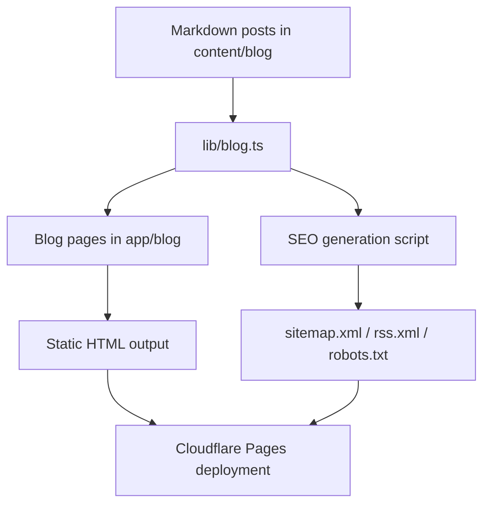

# Oler

Personal portfolio and SEO-first blog for Rodrigo Oler.

This repository powers:

- a pixel-perfect migration of the original portfolio site
- a Markdown-first blog with static SEO assets
- a Cloudflare Pages deployment built for static export

## Quick Start

```bash
npm ci
npm run dev
```

Other useful commands:

```bash
npm run build
npm run typecheck
npm run generate:seo
```

## What This Project Is

Oler is a Next.js application that keeps the visual language of the original HTML site while adding a structured blog for technical publishing.

The blog is designed to stay simple to operate:

- write posts in Markdown
- keep content in `content/blog`
- generate metadata, RSS, sitemap, and robots automatically
- publish through static export on Cloudflare Pages

## Tech Stack

- Next.js 16
- React 19
- Tailwind CSS 4
- TypeScript
- Markdown content with `gray-matter`, `remark`, and `remark-html`
- RSS generation with `feed`

## Architecture At A Glance



## Repository Layout

```text
app/            Next.js routes and page templates
components/     Shared UI, blog blocks, SEO helpers
content/blog/   Source Markdown posts
lib/            Blog loading and site helpers
public/         Static assets and generated SEO files
.github/        CI/CD workflows
```

## Blog Workflow

1. Create or update a Markdown file in `content/blog`.
2. Add frontmatter with the post metadata.
3. Run `npm run build` or `npm run generate:seo`.
4. The blog pages, RSS feed, sitemap, and robots file are regenerated from the same source.

### Post Rules

- Blog posts must always be written in English.
- Keep the writing concise, technical, and formal.
- Prefer Markdown-first content.
- When republishing an article from another source, keep canonical links intact.

### Recommended Frontmatter

```yaml
---
title: "Post Title"
description: "Short summary for SEO."
date: "2026-03-25"
slug: "post-title"
tags:
  - seo
  - nextjs
canonical: "https://example.com/original-post"
---
```

## Design Principles

- Preserve the original site colors unless explicitly asked to change them.
- Keep the blog visually aligned with the original HTML site.
- Prefer pixel-perfect migration over redesign.
- Use atomic design internally, but avoid unnecessary component layers.

## SEO Principles

- Every page should have page-specific metadata.
- Keep canonical URLs correct.
- Preserve sitemap, RSS, and robots generation.
- Prefer static SEO-friendly rendering.
- Do not sacrifice crawlability for unnecessary runtime rendering.

## Analytics

This site uses Plausible Analytics.

Suggested environment variables:

- `NEXT_PUBLIC_PLAUSIBLE_DOMAIN`

Set them in GitHub with:

```bash
gh secret set NEXT_PUBLIC_PLAUSIBLE_DOMAIN --repo rodrigooler/rodrigooler --body "oler.pages.dev"
```

## Deployment

The project is deployed to Cloudflare Pages as a static export.

Important:

- This repository does not rely on Cloudflare Workers for the current deployment path.
- SSR is not part of the default deployment model here.
- If a future feature truly requires server runtime, it will need a different deployment strategy.

### CI/CD

Deployment is handled by GitHub Actions:

- build the static site
- deploy the `out/` directory to Cloudflare Pages

Workflow file:

- [.github/workflows/deploy-cloudflare-pages.yml](.github/workflows/deploy-cloudflare-pages.yml)

## Project Rules

This repository follows the same rules documented in:

- [CLAUDE.md](CLAUDE.md)
- [AGENTS.md](AGENTS.md)

Key rules:

- posts always in English
- preserve original colors
- preserve pixel-perfect layouts
- keep the site static-friendly
- do not revert user changes unless explicitly asked

## Useful Links In The Codebase

- [Home page](app/page.tsx)
- [CV page](app/cv/page.tsx)
- [Blog index](app/blog/page.tsx)
- [Blog post template](app/blog/[slug]/page.tsx)
- [Blog data layer](lib/blog.ts)
- [SEO generator](scripts/generate-seo.mjs)
- [Global styles](app/globals.css)

## Notes On SSR

If you are evaluating deployment options:

- Cloudflare Pages static export is the current target.
- Static pages are enough for SEO when metadata and content are pre-rendered.
- If you need true SSR, Cloudflare Workers or Pages Functions become part of the equation.

## Maintenance Checklist

- Keep new posts in English.
- Keep metadata complete for every page.
- Run `npm run typecheck` before merging.
- Run `npm run build` before publishing.
- Check that `sitemap.xml`, `rss.xml`, and `robots.txt` are regenerated when content changes.
